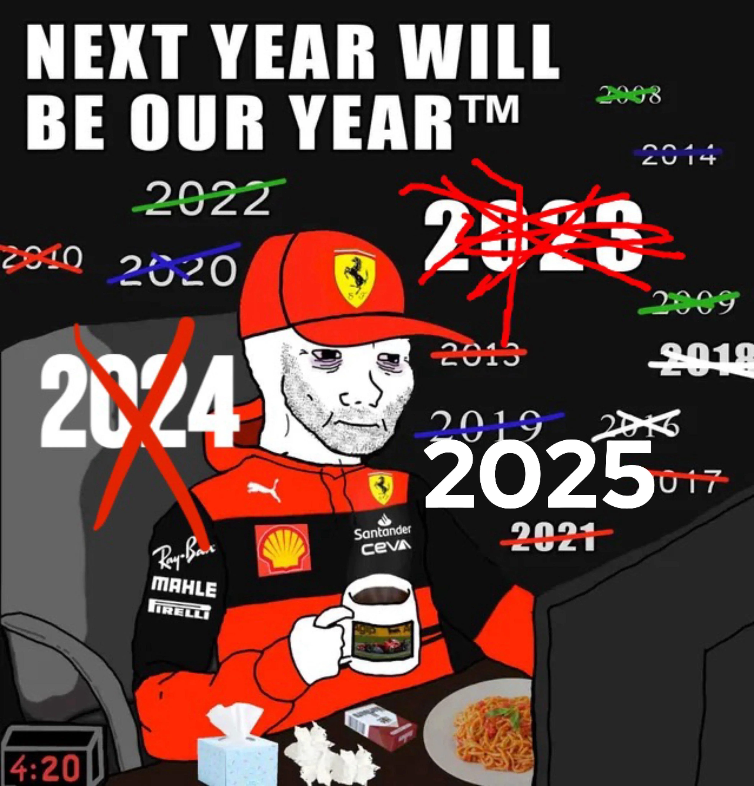

{}

拥有超过 5 年的 SRE 和云原生平台经验，管理过 400+ 节点的 Kubernetes 集群。 

曾在凉屋游戏、Coding、屈臣氏中国任职过SRE/运维开发等职务。

{}

{}

OpenResty Operator 是我第一个开源项目，起源于实际业务中管理内部 API 网关的需求。

当时市面上的方案如 Kong 或 APISIX 对我们来说过于复杂 —— 我们更需要一个轻量、基于 CRD、支持 GitOps、并易于融入 Kubernetes 原生生态的方案。

{}

{}

## 📬 Get in touch 
{.text-center}

欢迎交流合作、提问技术问题，或单纯打个招呼！
{.text-center}

📧 Email: `zehong.hongframe.huang@gmail.com`  
{.text-center}

{}

{}
是啊，这就是 Tifosi 的日常写照。
{.text-center}

{}